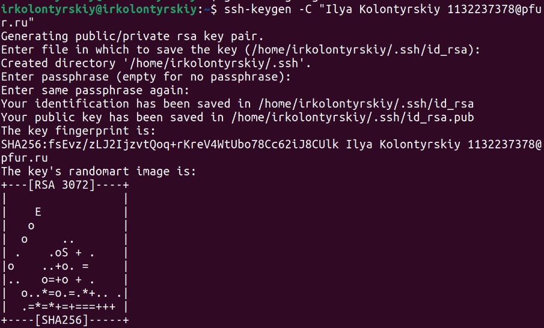

---
## Front matter
title: "Лабораторная работа №2"
subtitle: "Система контроля версий Git"
author: "Колонтырский Илья Русланович"

## Generic otions
lang: ru-RU
toc-title: "Содержание"

## Bibliography
bibliography: bib/cite.bib
csl: pandoc/csl/gost-r-7-0-5-2008-numeric.csl

## Pdf output format
toc: true # Table of contents
toc-depth: 2
lof: true # List of figures
lot: true # List of tables
fontsize: 12pt
linestretch: 1.5
papersize: a4
documentclass: scrreprt
## I18n polyglossia
polyglossia-lang:
  name: russian
  options:
	- spelling=modern
	- babelshorthands=true
polyglossia-otherlangs:
  name: english
## I18n babel
babel-lang: russian
babel-otherlangs: english
## Fonts
mainfont: PT Serif
romanfont: PT Serif
sansfont: PT Sans
monofont: PT Mono
mainfontoptions: Ligatures=TeX
romanfontoptions: Ligatures=TeX
sansfontoptions: Ligatures=TeX,Scale=MatchLowercase
monofontoptions: Scale=MatchLowercase,Scale=0.9
## Biblatex
biblatex: true
biblio-style: "gost-numeric"
biblatexoptions:
  - parentracker=true
  - backend=biber
  - hyperref=auto
  - language=auto
  - autolang=other*
  - citestyle=gost-numeric
## Pandoc-crossref LaTeX customization
figureTitle: "Рис."
tableTitle: "Таблица"
listingTitle: "Листинг"
lofTitle: "Список иллюстраций"
lotTitle: "Список таблиц"
lolTitle: "Листинги"
## Misc options
indent: true
header-includes:
  - \usepackage{indentfirst}
  - \usepackage{float} # keep figures where there are in the text
  - \floatplacement{figure}{H} # keep figures where there are in the text
---

# Цель работы

Изучить, как работает система контроля версий git и воспользоваться ею на практике

# Выполнение лабораторной работы

Настроим имя и почту пользователя git (рис. 2.1)

Настроим отображение UTF-8 (рис. 2.2)

Назовём стандартную ветку master (рис. 2.3)

Настроим отступы (рис. 2.4)

Сгенерируем ключ аутентификации для github (рис. 2.5)

Скопируем этот ключ (рис. 2.6)

И вставим его в github (рис. 2.7)

Создадим рабочую папку (рис. 2.8)

Создадим рабочий репозиторий из шаблона (рис. 2.9)

Перейдём в созданную папку и скачаем в неё созданный репозиторий (рис. 2.10)

Перейдём в папку с репозиторием и удалим лишние файлы (рис. 2.11)

Создадим с помощью make новые папки (рис. 2.12)

Загрузим изменения на гитхаб, прокомментировав то, что изменили (рис. 2.13)

Теперь окончательно отправим файлы на сервер (рис. 2.14)

После чего убедимся в успешной загрузке (рис. 2.15)

Теперь, в качестве самостоятельной работы, загрузим отчёты на gihub (рис. 2.16)

# Выводы

Был создан репозиторий, который был скачан на компьютер. Были получены навыкиработы с git
