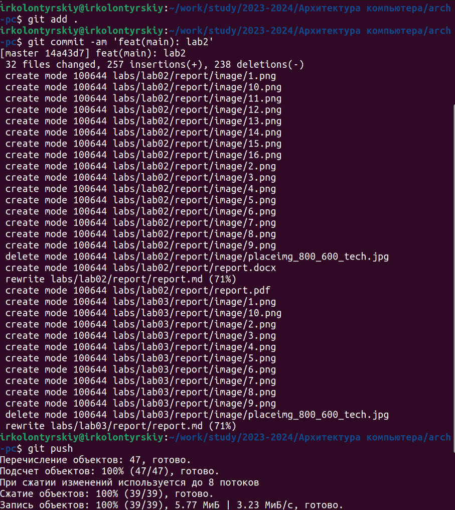

---
## Front matter
title: "Лабораторная работа №3"
subtitle: "Язык разметки Markdown"
author: "Колонтырский Илья Русланович"

## Generic otions
lang: ru-RU
toc-title: "Содержание"

## Bibliography
bibliography: bib/cite.bib
csl: pandoc/csl/gost-r-7-0-5-2008-numeric.csl

## Pdf output format
toc: true # Table of contents
toc-depth: 2
lof: true # List of figures
lot: true # List of tables
fontsize: 12pt
linestretch: 1.5
papersize: a4
documentclass: scrreprt
## I18n polyglossia
polyglossia-lang:
  name: russian
  options:
	- spelling=modern
	- babelshorthands=true
polyglossia-otherlangs:
  name: english
## I18n babel
babel-lang: russian
babel-otherlangs: english
## Fonts
mainfont: PT Serif
romanfont: PT Serif
sansfont: PT Sans
monofont: PT Mono
mainfontoptions: Ligatures=TeX
romanfontoptions: Ligatures=TeX
sansfontoptions: Ligatures=TeX,Scale=MatchLowercase
monofontoptions: Scale=MatchLowercase,Scale=0.9
## Biblatex
biblatex: true
biblio-style: "gost-numeric"
biblatexoptions:
  - parentracker=true
  - backend=biber
  - hyperref=auto
  - language=auto
  - autolang=other*
  - citestyle=gost-numeric
## Pandoc-crossref LaTeX customization
figureTitle: "Рис."
tableTitle: "Таблица"
listingTitle: "Листинг"
lofTitle: "Список иллюстраций"
lotTitle: "Список таблиц"
lolTitle: "Листинги"
## Misc options
indent: true
header-includes:
  - \usepackage{indentfirst}
  - \usepackage{float} # keep figures where there are in the text
  - \floatplacement{figure}{H} # keep figures where there are in the text
---

# Цель работы

Целью работы является освоение процедуры оформления отчетов с помощью легковесного
языка разметки Markdown

# Выполнение лабораторной работы

Перейдём в рабочую папку и обновим файлы на компьютере (Рис. 2.1)

Перейдём в папку третьей лабораторной работы и сгенерируем файлы отчёта (Рис. 2.2)

Убедимся в том, что они успешно созданы (Рис. 2.3)

Теперь посмотрим на корректность их генерирования (Рис. 2.4-2.5)

Теперь удалим их (Рис. 2.6)

Убедимся в успешном удалении (Рис. 2.7)

Теперь откроем файл .md (Рис. 2.8)

Посмотрим на то, как он выглядит (Рис. 2.9)

Теперь оформим отчёт и загрузим его на гитхаб (Рис. 2.10)

Теперь оформим отчёт второй лабораторной работы и сгенерируем его (Рис. 2.11)

И отправмим его на github (Рис. 2.11)

# Выводы

Были получены навыки работы с markdown, были созданы отчёты с его помощью
