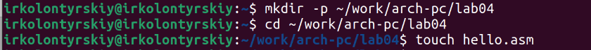
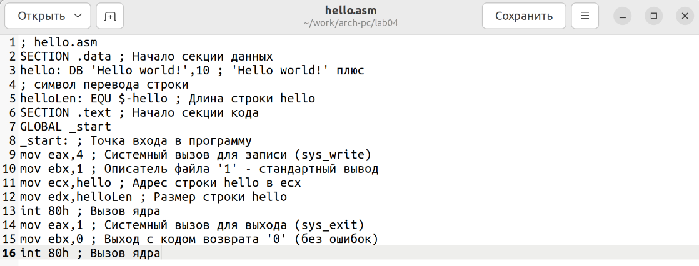
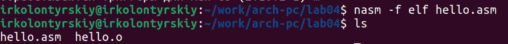
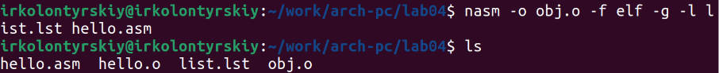
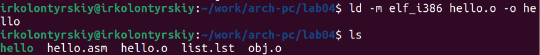
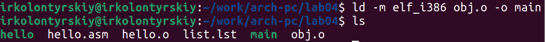
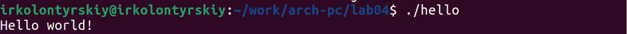
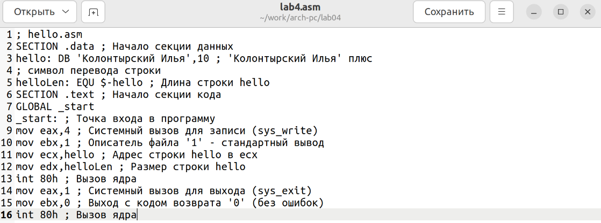
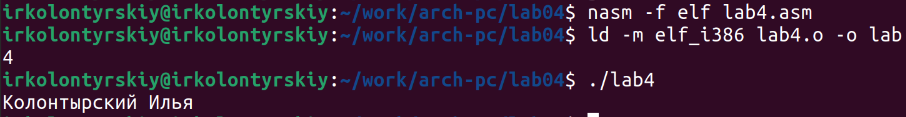
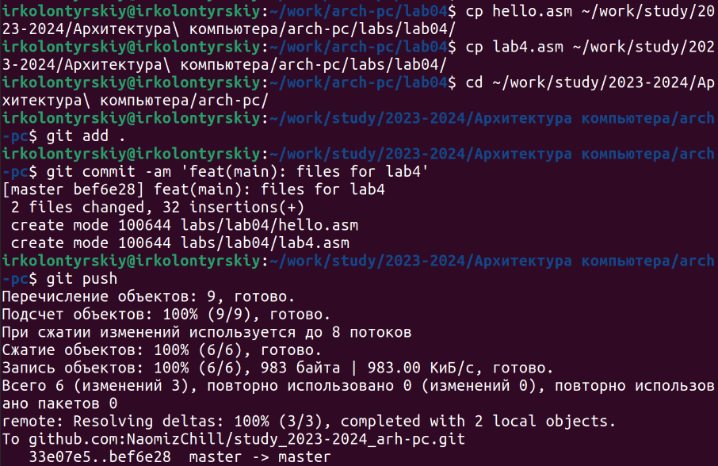

---
## Front matter
title: "Лабораторная работа №4"
subtitle: "Создание и процесс обработки программ на языке ассемблера NASM"
author: "Колонтырский Илья Русланович"

## Generic otions
lang: ru-RU
toc-title: "Содержание"

## Bibliography
bibliography: bib/cite.bib
csl: pandoc/csl/gost-r-7-0-5-2008-numeric.csl

## Pdf output format
toc: true # Table of contents
toc-depth: 2
lof: true # List of figures
lot: true # List of tables
fontsize: 12pt
linestretch: 1.5
papersize: a4
documentclass: scrreprt
## I18n polyglossia
polyglossia-lang:
  name: russian
  options:
	- spelling=modern
	- babelshorthands=true
polyglossia-otherlangs:
  name: english
## I18n babel
babel-lang: russian
babel-otherlangs: english
## Fonts
mainfont: PT Serif
romanfont: PT Serif
sansfont: PT Sans
monofont: PT Mono
mainfontoptions: Ligatures=TeX
romanfontoptions: Ligatures=TeX
sansfontoptions: Ligatures=TeX,Scale=MatchLowercase
monofontoptions: Scale=MatchLowercase,Scale=0.9
## Biblatex
biblatex: true
biblio-style: "gost-numeric"
biblatexoptions:
  - parentracker=true
  - backend=biber
  - hyperref=auto
  - language=auto
  - autolang=other*
  - citestyle=gost-numeric
## Pandoc-crossref LaTeX customization
figureTitle: "Рис."
tableTitle: "Таблица"
listingTitle: "Листинг"
lofTitle: "Список иллюстраций"
lotTitle: "Список таблиц"
lolTitle: "Листинги"
## Misc options
indent: true
header-includes:
  - \usepackage{indentfirst}
  - \usepackage{float} # keep figures where there are in the text
  - \floatplacement{figure}{H} # keep figures where there are in the text
---

# Цель работы

Освоение процедуры компиляции и сборки программ, написанных на ассемблере NASM

# Выполнение лабораторной работы

Создадим папку для хранения файлов и создадим там файл в формате .asm (рис. 1)

Откроем файл для редактирования (рис. 2)

Вставим в файл требуемый код (рис. 3)

Скомпилируем код в объектный файл с помощью nasm и убедимся в том, что он был создан (рис. 4)

Объектный файл имеет такое же имя, как и у файла .asm, только с расширением .obj. 
Теперь скомпилируем код с большим количеством аргументов (рис. 5)

Соберём исполняемый файл с помощью ld и проверим успешность операции (рис. 6)

Соберём другой файл и проверим успешность его сборки (рис. 7)

Здесь исполняемый файл будет иметь имя main, и будет собираться из файла obj.o. Запустим один из собранных файлов (рис. 8)

Создадим копию файла с исходным кодом (рис. 9)

Изменим код так, чтобы программа выводила фамилию и имя (рис. 10)

Соберём исполняемый файл и проверим его работу (рис. 11)

Скопируем .asm файлы в рабочую папку и загрузим их на гитхаб (рис. 12)

# Выводы

Были получены базовые навыки работы с ассемблером и сборкой исполняемых файлов из него
