---
## Front matter
title: "Лабораторная работа №5"
subtitle: "Основы работы с Midnight Commander (mc). Структура программы на языке ассемблера NASM. Системные вызовы в ОС GNU Linux"
author: "Колонтырский Илья Русланович"

## Generic otions
lang: ru-RU
toc-title: "Содержание"

## Bibliography
bibliography: bib/cite.bib
csl: pandoc/csl/gost-r-7-0-5-2008-numeric.csl

## Pdf output format
toc: true # Table of contents
toc-depth: 2
lof: true # List of figures
lot: true # List of tables
fontsize: 12pt
linestretch: 1.5
papersize: a4
documentclass: scrreprt
## I18n polyglossia
polyglossia-lang:
  name: russian
  options:
	- spelling=modern
	- babelshorthands=true
polyglossia-otherlangs:
  name: english
## I18n babel
babel-lang: russian
babel-otherlangs: english
## Fonts
mainfont: PT Serif
romanfont: PT Serif
sansfont: PT Sans
monofont: PT Mono
mainfontoptions: Ligatures=TeX
romanfontoptions: Ligatures=TeX
sansfontoptions: Ligatures=TeX,Scale=MatchLowercase
monofontoptions: Scale=MatchLowercase,Scale=0.9
## Biblatex
biblatex: true
biblio-style: "gost-numeric"
biblatexoptions:
  - parentracker=true
  - backend=biber
  - hyperref=auto
  - language=auto
  - autolang=other*
  - citestyle=gost-numeric
## Pandoc-crossref LaTeX customization
figureTitle: "Рис."
tableTitle: "Таблица"
listingTitle: "Листинг"
lofTitle: "Список иллюстраций"
lotTitle: "Список таблиц"
lolTitle: "Листинги"
## Misc options
indent: true
header-includes:
  - \usepackage{indentfirst}
  - \usepackage{float} # keep figures where there are in the text
  - \floatplacement{figure}{H} # keep figures where there are in the text
---

# Цель работы

Приобретение практических навыков работы в Midnight Commander. Освоение инструкций языка ассемблера mov и int

# Выполнение лабораторной работы

Откроем mc (рис. 2.1)

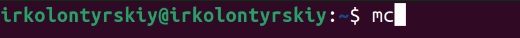

Перейдём в папку с файлами для лабораторных работ и создадим в ней папку lab05 (рис. 2.2)

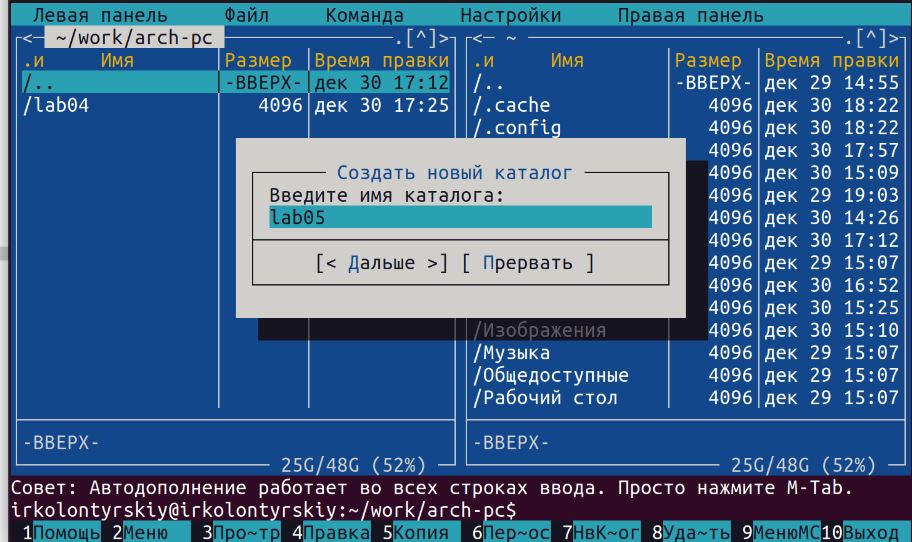

Перейдём в неё и создадим файл lab5-1.asm (рис. 2.3)

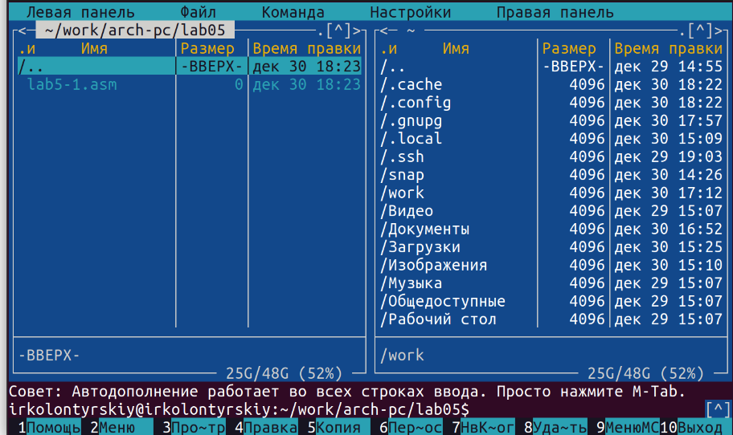

Откроем его для редактирования и вставим следующий код (рис. 2.4)

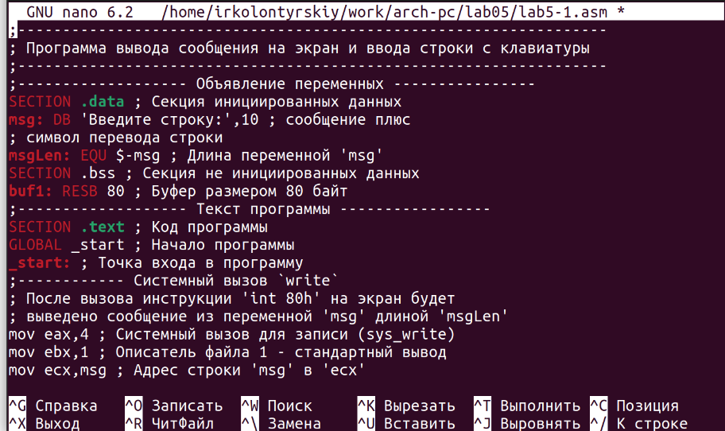

Сохраним его и откроем файл для просмотра, чтобы убедиться, что всё было сохранено (рис. 2.5)

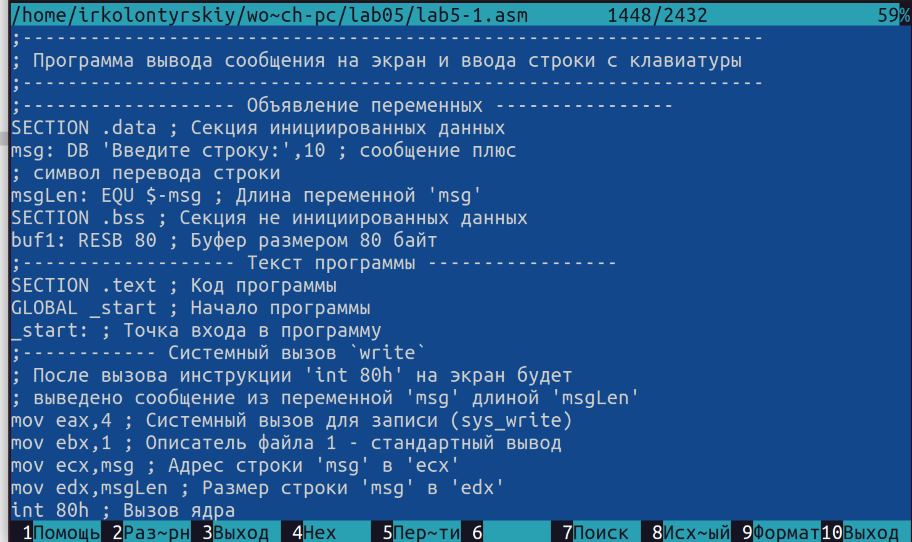

Соберём его и проверим на работоспособность (рис. 2.6)

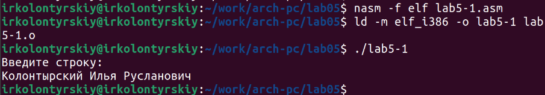

Скопируем файл in_out.asm в нашу папку (рис. 2.7)

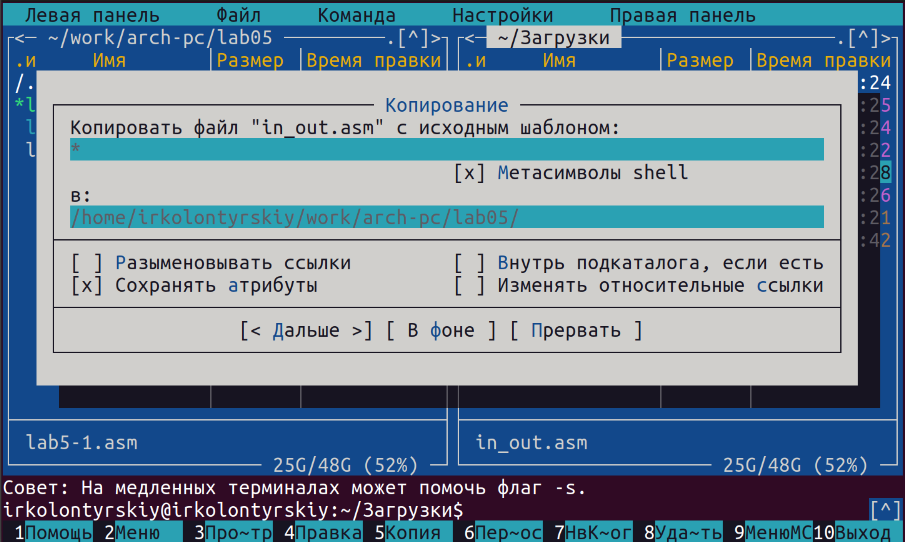

Создадим копию файла lab5-1.asm (рис. 2.8)

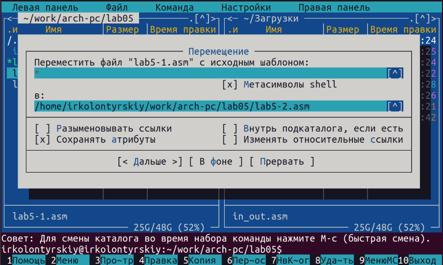

И вставим в него следующий код (рис. 2.9)

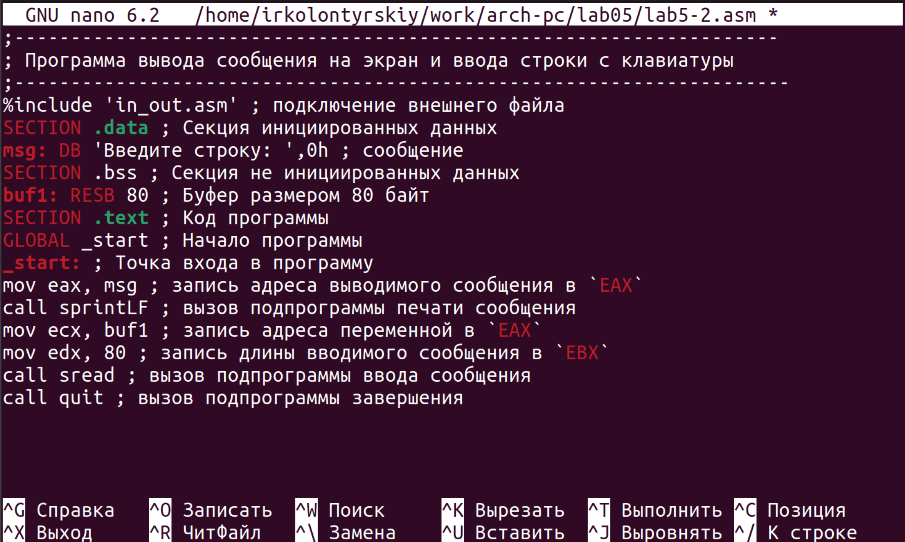

Соберём программу и проверим её работу (рис. 2.10)

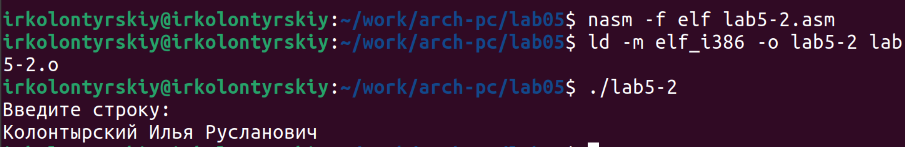

Заменим в коде программы sprintLF на sprint (рис. 2.11)

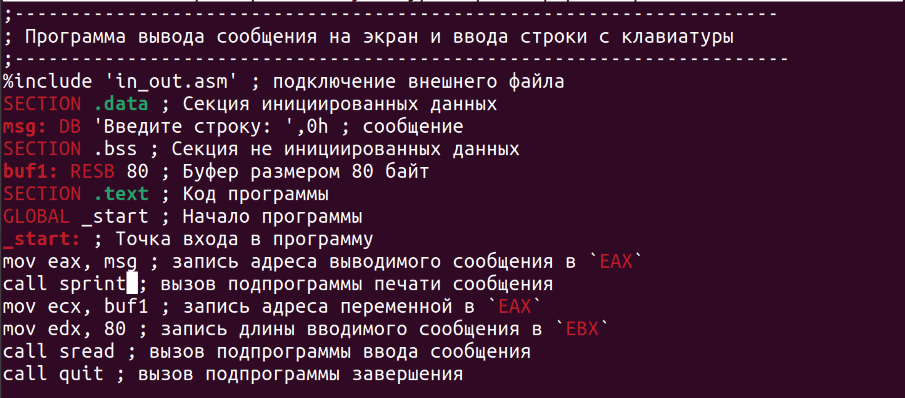

Соберём программу заново и запустим (рис. 2.12)

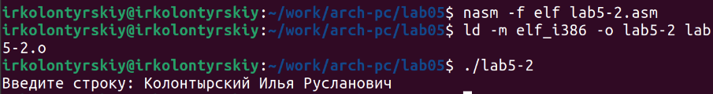

Теперь мы вводим данные в той же строке, в которой они выводятся. Теперь сделаем копию первого файла и назовём её lab5-3.asm и изменим её так, чтобы выводилась введённая нами строка (рис. 2.13)

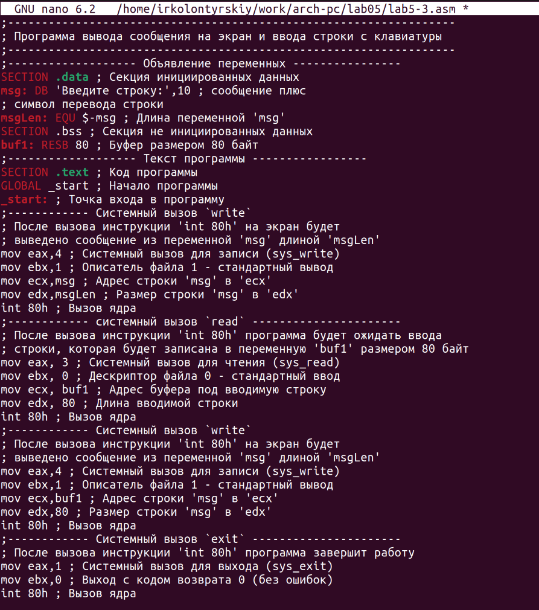

И запустим собранную программу для проверки (рис. 2.14)

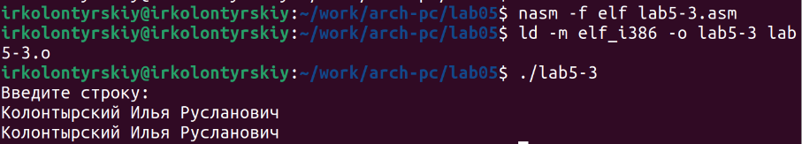

Теперь создадим копию второго файла (lab5-2.asm) и назовём её lab5-4.asm. Сделаем так, чтобы она также выводила введённую тами информацию (рис. 2.15)

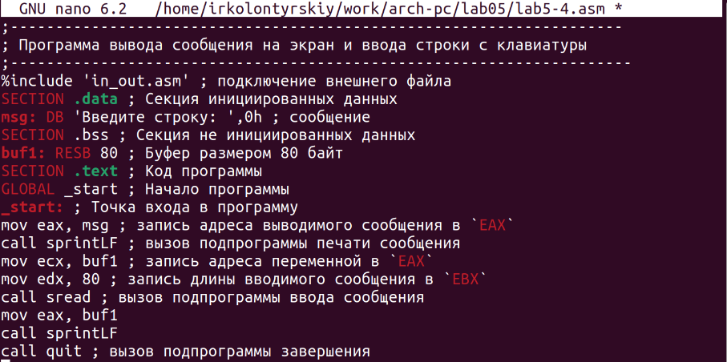

Теперь запустим её, предварительно собрав (рис. 2.16)

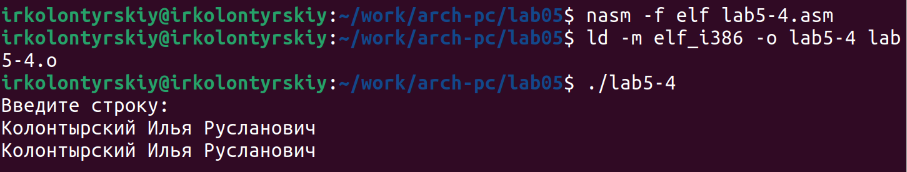

# Выводы

Был получен навык работы с mc, а также были получены навыки ввода и вывода информации в nasm
