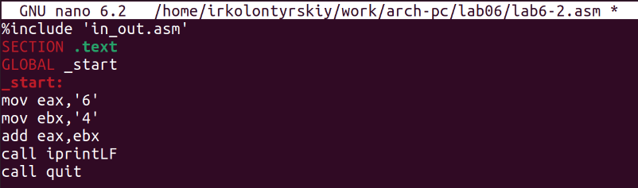
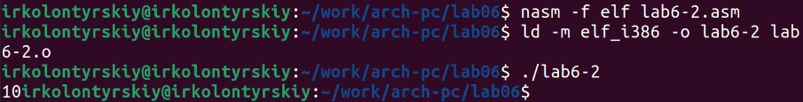
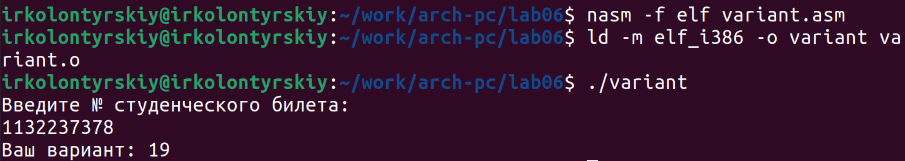

---
## Front matter
title: "Лабораторная работа №6"
subtitle: "Арифметические операции в NASM"
author: "Колонтырский Илья Русланович"

## Generic otions
lang: ru-RU
toc-title: "Содержание"

## Bibliography
bibliography: bib/cite.bib
csl: pandoc/csl/gost-r-7-0-5-2008-numeric.csl

## Pdf output format
toc: true # Table of contents
toc-depth: 2
lof: true # List of figures
lot: true # List of tables
fontsize: 12pt
linestretch: 1.5
papersize: a4
documentclass: scrreprt
## I18n polyglossia
polyglossia-lang:
  name: russian
  options:
	- spelling=modern
	- babelshorthands=true
polyglossia-otherlangs:
  name: english
## I18n babel
babel-lang: russian
babel-otherlangs: english
## Fonts
mainfont: PT Serif
romanfont: PT Serif
sansfont: PT Sans
monofont: PT Mono
mainfontoptions: Ligatures=TeX
romanfontoptions: Ligatures=TeX
sansfontoptions: Ligatures=TeX,Scale=MatchLowercase
monofontoptions: Scale=MatchLowercase,Scale=0.9
## Biblatex
biblatex: true
biblio-style: "gost-numeric"
biblatexoptions:
  - parentracker=true
  - backend=biber
  - hyperref=auto
  - language=auto
  - autolang=other*
  - citestyle=gost-numeric
## Pandoc-crossref LaTeX customization
figureTitle: "Рис."
tableTitle: "Таблица"
listingTitle: "Листинг"
lofTitle: "Список иллюстраций"
lotTitle: "Список таблиц"
lolTitle: "Листинги"
## Misc options
indent: true
header-includes:
  - \usepackage{indentfirst}
  - \usepackage{float} # keep figures where there are in the text
  - \floatplacement{figure}{H} # keep figures where there are in the text
---

# Цель работы

Освоение арифметических инструкций языка ассемблера NASM

# Выполнение лабораторной работы

Создадим папку рабочего каталога и файл lab6-1.asm (Рис. 2.1)

Вставим в созданный файл код из листинга (Рис. 2.2)

Теперь соберём  файл и запустим его (Рис. 2.3)

Вывело символ j. Изменим файл (Рис. 2.4)

Мы убрали кавычки и теперь складываем числа. Соберём и запустим файл (Рис. 2.5)

Ничего не вывелось. Но на самом деле вывелся символ перевода строки, и поэтому мы его не видим. 
Создадим файл под названием lab6-2.asm (Рис. 2.6)

Вставим в него следующий код (Рис. 2.7)

Вместо sprintLF тут iprintLF. Соберём файл и запустим (Рис. 2.8)

Вывело число 106. Уберём кавычки у чисел в коде (Рис. 2.9)

Соберём и запустим программу (Рис. 2.10)

Вывод корректный. Заменим iprintLF на iprint (Рис. 2.11)

Соберём и запустим (Рис. 2.12)

iprint не использует перенос на новую строку.
Создадим ещё 1 файл (Рис. 2.13)

Он считает выражение (5*2+3)/3. Вставим в него следующий код (Рис. 2.14)

Попробуем запустить этот программу, предварительно её собрав (Рис. 2.15)

Вычисления верные. Сделаем так, чтобы код вычислял функцию f(x)=(4*6+2)/5. Внесём следующие изменения (Рис. 2.16)

Соберём и запустим (Рис. 2.17)

Ответ верный. Создадим файл variant.asm. Он должен вычислять номер варианта по студенческому билету (Рис. 2.18)

Вставим в него следующий код (Рис. 2.19)

Скомпилируем и запустим файл. Укажем в вводе студенческий билет (Рис. 2.20):

 Пересчитав вручную, находим, что это верный ответ

 Ответим на вопросы:

 1. Какие строки листинга 6.4 отвечают за вывод на экран сообщения ‘Ваш вариант:’?

 Строчка под номером 25

 

 2. Для чего используется следующие инструкции?

 mov ecx, x

 mov edx, 80

 call sread

 Они записывают ввод с клавиатуры в переменную х

 

 3. Для чего используется инструкция “call atoi”?

 Для преобразования кода символа в число

 

 4. Какие строки листинга 6.4 отвечают за вычисления варианта?

 div ebx

 inc edx

 

 5. В какой регистр записывается остаток от деления при выполнении инструкции “div ebx”?

 В edx

 

 6. Для чего используется инструкция “inc edx”?

 Прибавляет к edx единицу

 7. Какие строки листинга 6.4 отвечают за вывод на экран результата вычислений?

 mov eax,edx

 call iprintLF

 Самостоятельная работа

Создадим файл самостоятельной работы (Рис. 2.21)

Теперь напишем следующий код (Рис. 2.22)

Проверим работу программы, собрав и запустив её (Рис. 2.23)

Программа дала верные ответы

# Выводы

Были получены навыки работы с арифметическими инструкциями языка ассемблера
