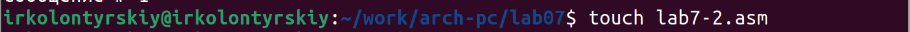

---
## Front matter
title: "Лабораторная работа №7"
subtitle: "Команды безусловного и условного переходов в Nasm. Программирование ветвлений"
author: "Колонтырский Илья Русланович"

## Generic otions
lang: ru-RU
toc-title: "Содержание"

## Bibliography
bibliography: bib/cite.bib
csl: pandoc/csl/gost-r-7-0-5-2008-numeric.csl

## Pdf output format
toc: true # Table of contents
toc-depth: 2
lof: true # List of figures
lot: true # List of tables
fontsize: 12pt
linestretch: 1.5
papersize: a4
documentclass: scrreprt
## I18n polyglossia
polyglossia-lang:
  name: russian
  options:
	- spelling=modern
	- babelshorthands=true
polyglossia-otherlangs:
  name: english
## I18n babel
babel-lang: russian
babel-otherlangs: english
## Fonts
mainfont: PT Serif
romanfont: PT Serif
sansfont: PT Sans
monofont: PT Mono
mainfontoptions: Ligatures=TeX
romanfontoptions: Ligatures=TeX
sansfontoptions: Ligatures=TeX,Scale=MatchLowercase
monofontoptions: Scale=MatchLowercase,Scale=0.9
## Biblatex
biblatex: true
biblio-style: "gost-numeric"
biblatexoptions:
  - parentracker=true
  - backend=biber
  - hyperref=auto
  - language=auto
  - autolang=other*
  - citestyle=gost-numeric
## Pandoc-crossref LaTeX customization
figureTitle: "Рис."
tableTitle: "Таблица"
listingTitle: "Листинг"
lofTitle: "Список иллюстраций"
lotTitle: "Список таблиц"
lolTitle: "Листинги"
## Misc options
indent: true
header-includes:
  - \usepackage{indentfirst}
  - \usepackage{float} # keep figures where there are in the text
  - \floatplacement{figure}{H} # keep figures where there are in the text
---

# Цель работы

Изучение команд условного и безусловного переходов. Приобретение навыков написания программ с использованием переходов. Знакомство с назначением и структурой файла листинга

# Выполнение лабораторной работы

Создадим папку lab07 и файл lab7-1.asm (рис. 2.1)

Теперь вставим предложенный код в файл lab7-1.asm (рис. 2.2)

Теперь соберём программу и проверим её рпботу (рис. 2.3)

Изменим файл lab7-1.asm, вставив предложенный код (рис. 2.4)

Ещё раз скомпилируем программу, проверим её (рис. 2.5)

Нужно сделать так, чтобы программа выводила сообщения от третьего к первому. Изменим код следующим образом (рис. 2.6)

Соберём и запустим программу (рис. 2.7)

Теперь создадим файл второй файл - lab7-2.asm (рис. 2.8)

Вставим в файл lab7-2.asm следующий код (рис. 2.9)

Теперь скомпилируем его и запустим, провери для разных значений (рис. 2.10)

Попробуем пересобрать файл lab7-2.asm так, чтобы создался файл листинга и откроем файл листинга (рис. 2.11)

После его открытия мы видим следующее (рис. 2.12)

Теперь рассмотрим несколько строк файла листинга:

 1. Строка 21 перемещает значение переменной B регистр eax

 2. Строка 22 преобразовывает значение регистра eax в число

 3. Строка 23 перемещает значение регистра eax в переменную B

 Намеренно сделаем ошибку в коде, и уберём у команды mov один операнд (рис. 2.13)

Теперь соберём этот файл и создадим файл листинга (рис. 2.14)

Откроем файл листинга и посмотрим на изменения (рис. 2.15)

Заметим, что в листинге появилась ошибка

 Самостоятельная работа

Создадим файлы для самостоятельной работы (19 вариант) (рис. 2.16)

Код для выполнения первого задания выглядит так (рис. 2.17)

Скомпилируем его и посмотрим на результат (рис. 2.18)

Код для выполнения второго задания выглядит так (рис. 2.19)

Скомпилируем его и посмотрим на результат (рис. 2.20)

Программы считают всё верно

# Выводы

Были изучены команды условных и безусловных переходов, а также они были применены на практике. Была рассмотрена работа с файлами листинга
