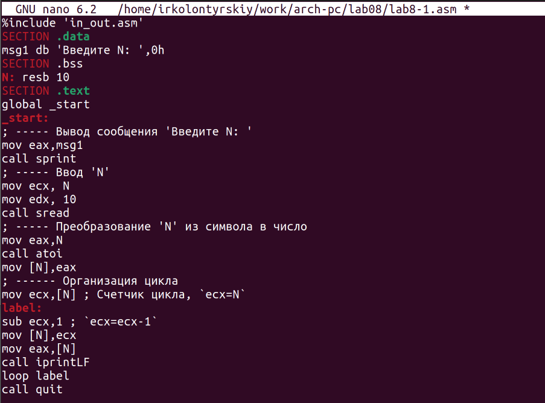

---
## Front matter
title: "Лабораторная работа №8"
subtitle: "Программирование цикла. Обработка аргументов командной строки"
author: "Колонтырский Илья Русланович"

## Generic otions
lang: ru-RU
toc-title: "Содержание"

## Bibliography
bibliography: bib/cite.bib
csl: pandoc/csl/gost-r-7-0-5-2008-numeric.csl

## Pdf output format
toc: true # Table of contents
toc-depth: 2
lof: true # List of figures
lot: true # List of tables
fontsize: 12pt
linestretch: 1.5
papersize: a4
documentclass: scrreprt
## I18n polyglossia
polyglossia-lang:
  name: russian
  options:
	- spelling=modern
	- babelshorthands=true
polyglossia-otherlangs:
  name: english
## I18n babel
babel-lang: russian
babel-otherlangs: english
## Fonts
mainfont: PT Serif
romanfont: PT Serif
sansfont: PT Sans
monofont: PT Mono
mainfontoptions: Ligatures=TeX
romanfontoptions: Ligatures=TeX
sansfontoptions: Ligatures=TeX,Scale=MatchLowercase
monofontoptions: Scale=MatchLowercase,Scale=0.9
## Biblatex
biblatex: true
biblio-style: "gost-numeric"
biblatexoptions:
  - parentracker=true
  - backend=biber
  - hyperref=auto
  - language=auto
  - autolang=other*
  - citestyle=gost-numeric
## Pandoc-crossref LaTeX customization
figureTitle: "Рис."
tableTitle: "Таблица"
listingTitle: "Листинг"
lofTitle: "Список иллюстраций"
lotTitle: "Список таблиц"
lolTitle: "Листинги"
## Misc options
indent: true
header-includes:
  - \usepackage{indentfirst}
  - \usepackage{float} # keep figures where there are in the text
  - \floatplacement{figure}{H} # keep figures where there are in the text
---

# Цель работы

Приобретение навыков написания программ с использованием циклов и обработкой
аргументов командной строки

# Выполнение лабораторной работы

Создадим рабочую папку и файл lab8-1.asm (рис. 2.1)

Вставим в файл предложенный код (рис. 2.2)

Скомпилируем файл и посмотрим результат (рис. 2.3)

Изменим код программы следующим образом (рис. 2.4)

Скомпилируем и запустим программу. Подадим на вход число 10 и посмотрим на результат (рис. 2.5)

Как мы видим, в цикле значение регистра ecx меняется 2 раза, поэтому нам выводятся числа через один. Соответственно, число проходов цикла значению N не соотвестсвует.

 Теперь изменим программу для её правильной работы (рис. 2.6)

Скомпилируем и запустим программу (рис. 2.7)

Сейчас количество прогонов соответствует числу N. Теперь создадим второй файл (рис. 2.8)

Вставим в него следующий код (рис. 2.9)

Скомпилируем его и запустим, указав предложенные аргументы (рис. 2.10)

Программа обработала 4 агумента, разделённых пробелами. Пробелы в кавычках не считаются разделителями. Создадим третий файл (рис. 2.11)

Вставим в него код для нахождения суммы аргументов (рис. 2.12)

Скомпилируем код и запустим его (рис. 2.13)

Программа работает правильно. Сделаем так, чтобы она искала не сумму, а произведение (рис. 2.14):

Скомпилируем и запустим программу (рис. 2.15)

Ответ верный

 Самостоятельная работа

Создадим файл программы для самостоятельной работы (рис. 2.16)

Напишем программу для 19 варианта, где нужно сложить все f(x)=8x-3 (рис. 2.17)

Скомпилируем и проверим работу программы (рис. 2.18)

Программа работает верно

# Выводы

Были получены навыки работы с циклами, а также с аргументами командной строки
