---
## Front matter
title: "Лабораторная работа №9"
subtitle: "Понятие подпрограммы. Отладчик GDB"
author: "Колонтырский Илья Русланович"

## Generic otions
lang: ru-RU
toc-title: "Содержание"

## Bibliography
bibliography: bib/cite.bib
csl: pandoc/csl/gost-r-7-0-5-2008-numeric.csl

## Pdf output format
toc: true # Table of contents
toc-depth: 2
lof: true # List of figures
lot: true # List of tables
fontsize: 12pt
linestretch: 1.5
papersize: a4
documentclass: scrreprt
## I18n polyglossia
polyglossia-lang:
  name: russian
  options:
	- spelling=modern
	- babelshorthands=true
polyglossia-otherlangs:
  name: english
## I18n babel
babel-lang: russian
babel-otherlangs: english
## Fonts
mainfont: PT Serif
romanfont: PT Serif
sansfont: PT Sans
monofont: PT Mono
mainfontoptions: Ligatures=TeX
romanfontoptions: Ligatures=TeX
sansfontoptions: Ligatures=TeX,Scale=MatchLowercase
monofontoptions: Scale=MatchLowercase,Scale=0.9
## Biblatex
biblatex: true
biblio-style: "gost-numeric"
biblatexoptions:
  - parentracker=true
  - backend=biber
  - hyperref=auto
  - language=auto
  - autolang=other*
  - citestyle=gost-numeric
## Pandoc-crossref LaTeX customization
figureTitle: "Рис."
tableTitle: "Таблица"
listingTitle: "Листинг"
lofTitle: "Список иллюстраций"
lotTitle: "Список таблиц"
lolTitle: "Листинги"
## Misc options
indent: true
header-includes:
  - \usepackage{indentfirst}
  - \usepackage{float} # keep figures where there are in the text
  - \floatplacement{figure}{H} # keep figures where there are in the text
---

# Цель работы

Приобретение навыков написания программ с использованием подпрограмм. Знакомство
с методами отладки при помощи GDB и его основными возможностями

# Выполнение лабораторной работы

Создадим папку и файл lab9-1.asm (Рис. 2.1)

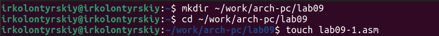

Вставим в файл lab9-1.asm предложенный код (Рис. 2.2)

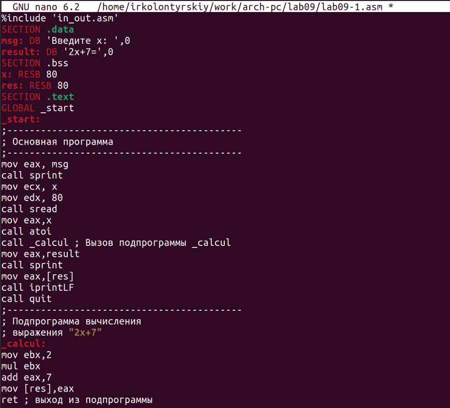

Скомпилируем программу и посмотрим на результат (Рис. 2.3)

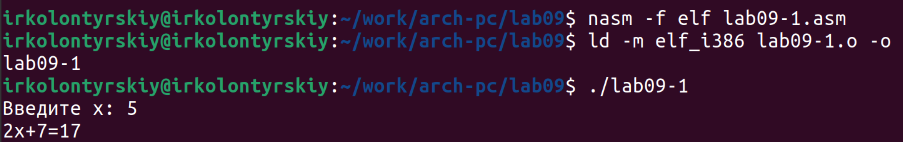

Изменим программу, добавив подпрограмму, которая вычисляет g(x), после чего выводит результат вычисления f(g(x)) (Рис. 2.4)

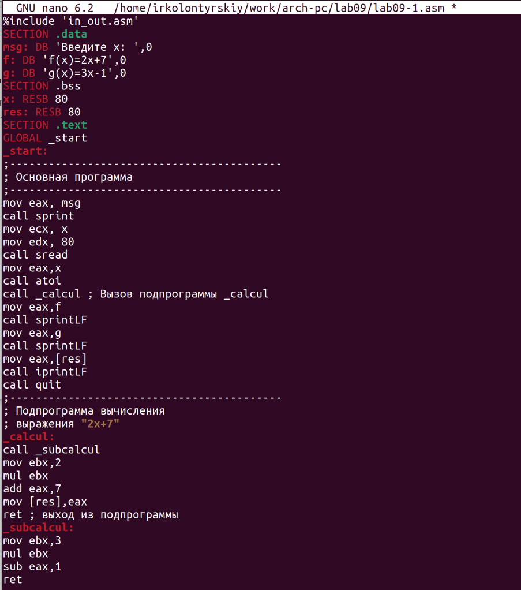

Скомпилируем программу и посмотрим на результат (Рис. 2.5)

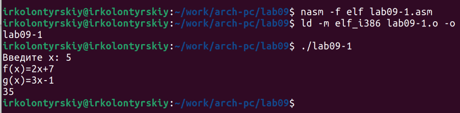

Создадим ещё один файл (Рис. 2.6)

Вставим файл следующий код (Рис. 2.7)

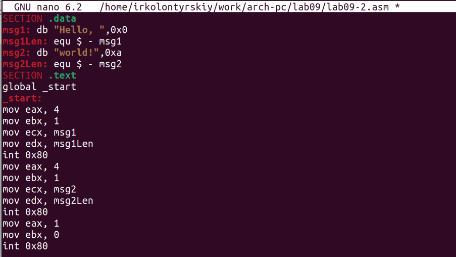

Скомпилируем программу для отладки (с аргументом -g) и загрузим в gdb (Рис. 2.8)

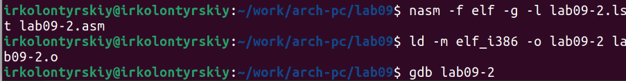

В gdb запустим её с помощью run (Рис. 2.9)

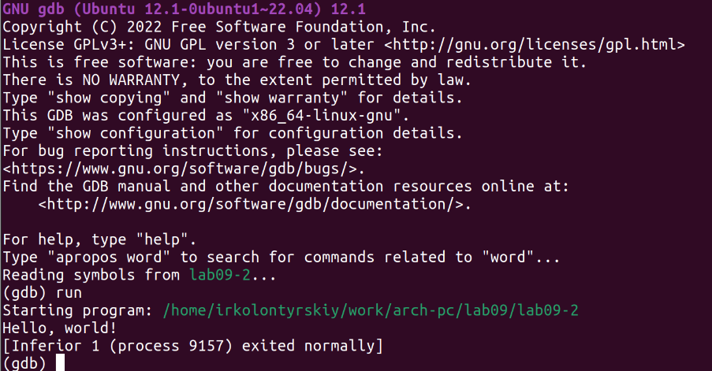

На метке _start создадим брейкпоинт (Рис. 2.10)

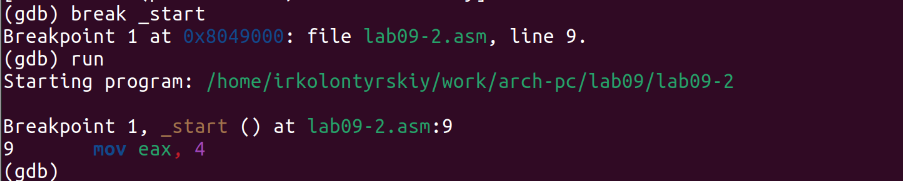

Теперь дизассемблируем программу (Рис. 2.11)

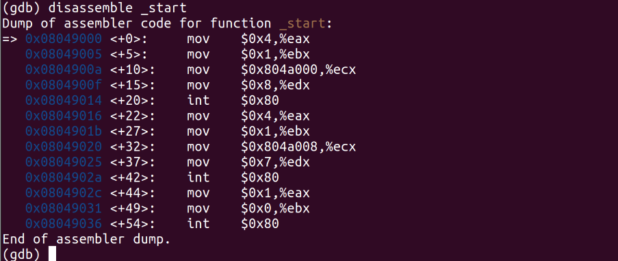

Теперь сделаем вывод на синтаксисе intel (Рис. 2.12)

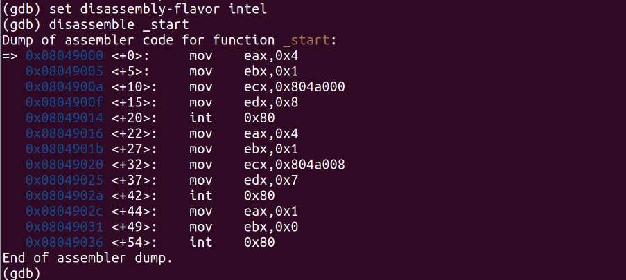

Включим отображения кода и регистров (Рис. 2.13)

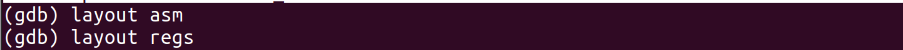

Выведем инормацию о брейкпоинтах (Рис. 2.14)

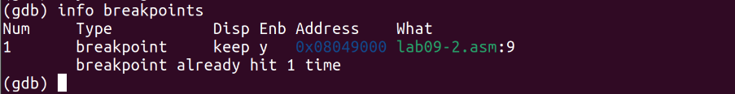

Теперь создадим брейкпоинт не по имени, а по адресу, а также выведем информацию обо всех брейкпоинтах (Рис. 2.15)

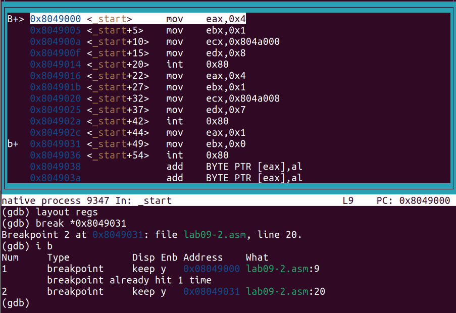

Теперь выполним команду si 5 раз, выполнив тем самым последовательно 5 строчек кода (Рис. 2.16)

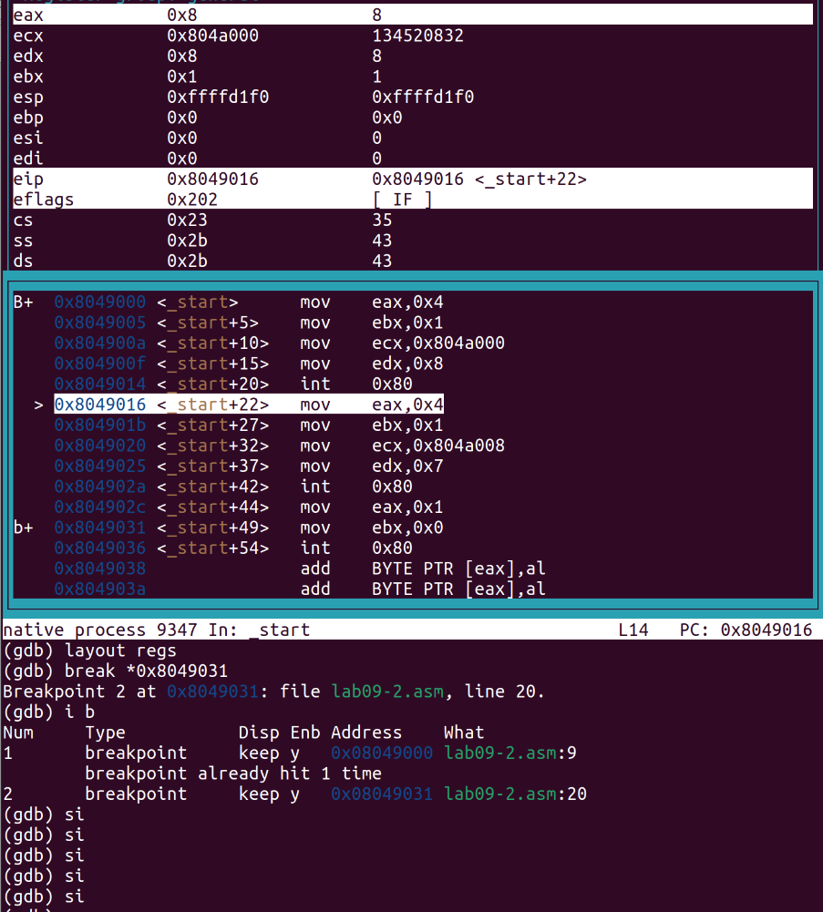

За 5 строк поменялись значения eax, ecx, edx и ebx регистров. Выведем информацию о значениях регистров (Рис. 2.17)

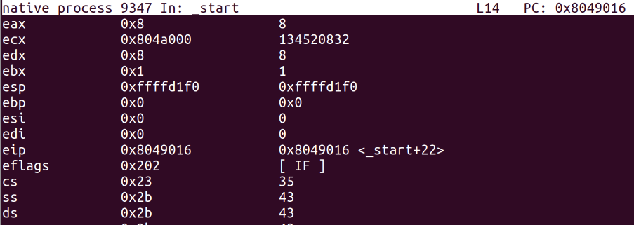

Выведем значение переменной (Рис. 2.18)

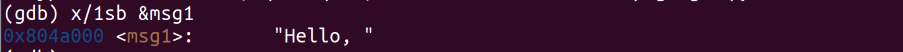

Выведем теперь значение переменной по адресу (Рис. 2.19)

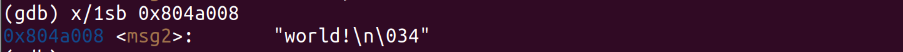

Изменим значение переменной и выведем его (Рис. 2.20)

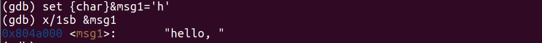

Изменим вторую переменную и выведем её (Рис. 2.21)

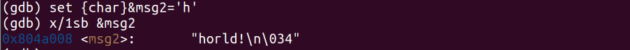

Выведем значение регистра edx в строковом, двоичном, шестнадцатиричном видах (Рис. 2.22)

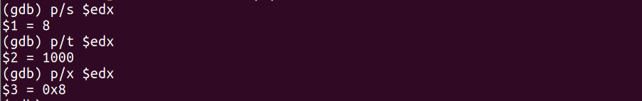

Изменим теперь значение регистра (Рис. 2.23)

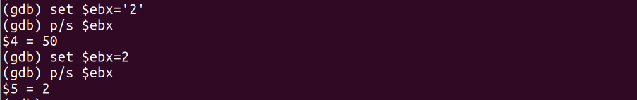

Мы записали в регистр 2 разных значения. В первом случае это строка, а во втором - число. Выйдем из отладчика и скопируем файл из прошлой работы, соберм его и вгрузим в отладчик (Рис. 2.24)

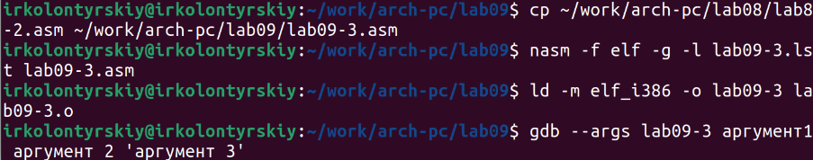

Создадим брейкпоинт и запустим его, после чего выведем значение регистра esp (Рис. 2.25)

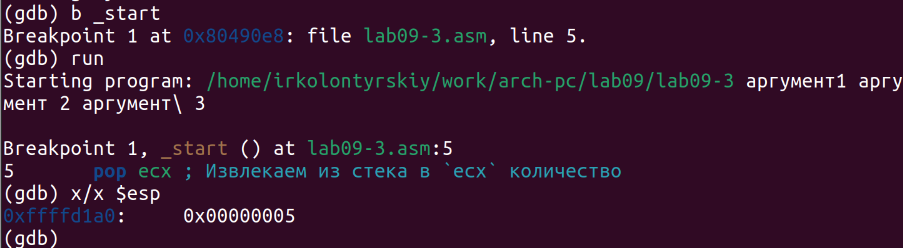

Выведем значение элементов стека (Рис. 2.26)

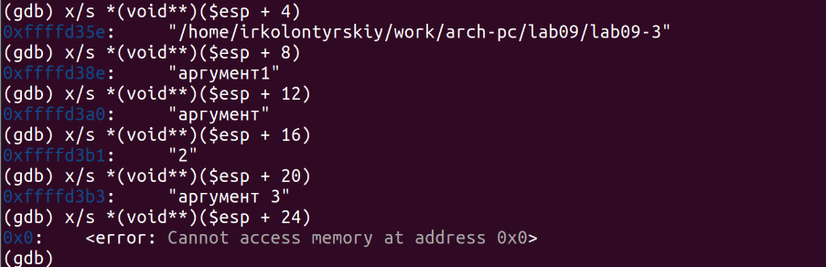

Поскольку под каждый элемент стека выделяется 4 байта, мы должны выводить элементы с шагом в 4

 Самостоятельная работа

Создадим файлы для самостоятельной работы (Рис. 2.27)

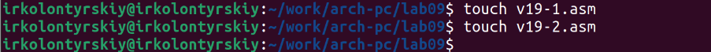

В первом файле нам нужно переписать файл первой самостоятельной работы прошлой лабораторной работы с использованием подпрограмм (Рис. 2.28)

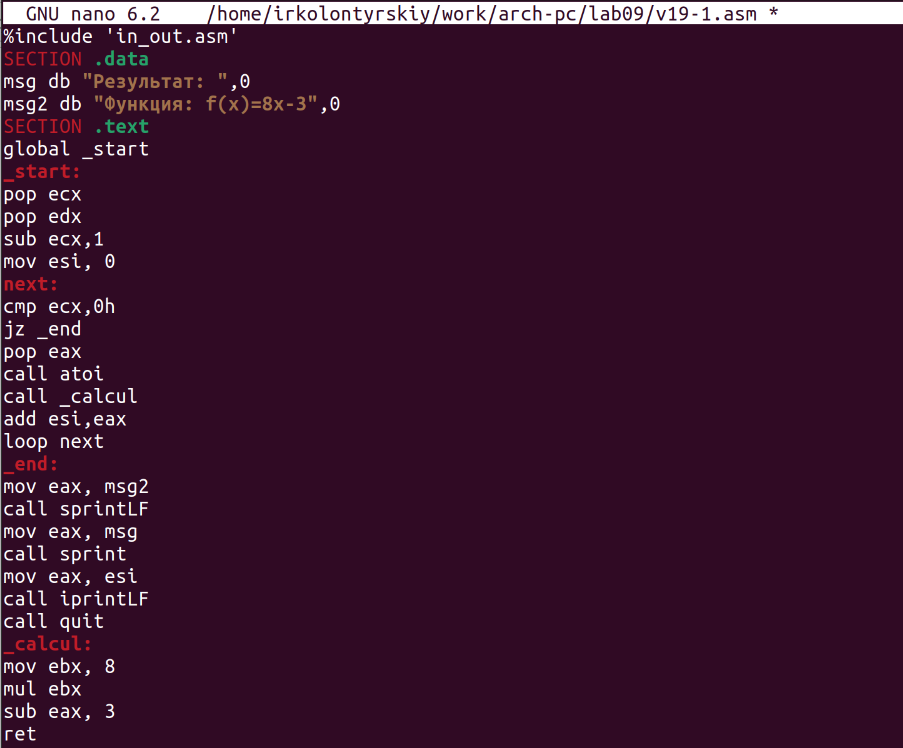

Скомпилируем файл и проверим его работу (Рис. 2.29)

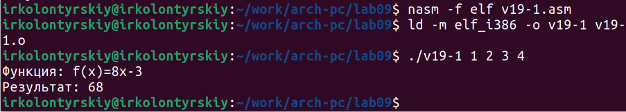

Вставим во второй код предложенный код (Рис. 2.30)

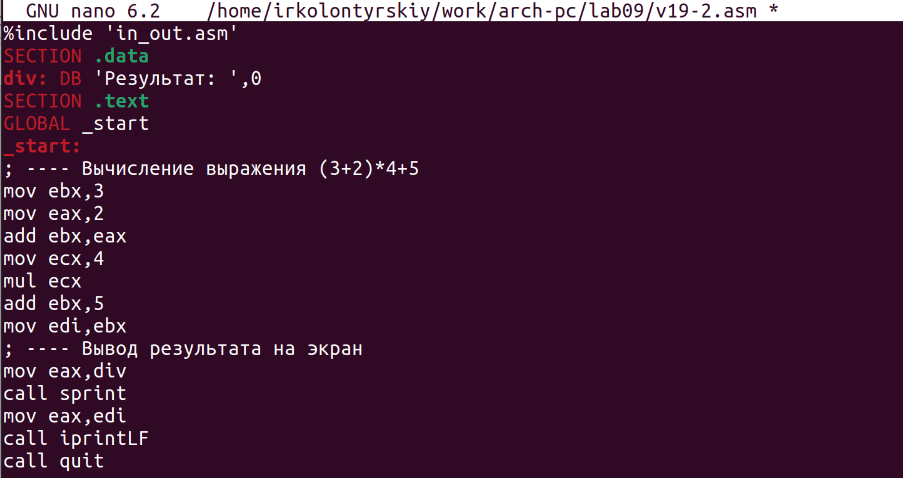

Соберём его и вставим в gdb (Рис. 2.31)

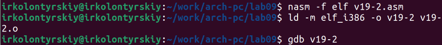

Начнём построчно выполнять код (Рис. 2.32):

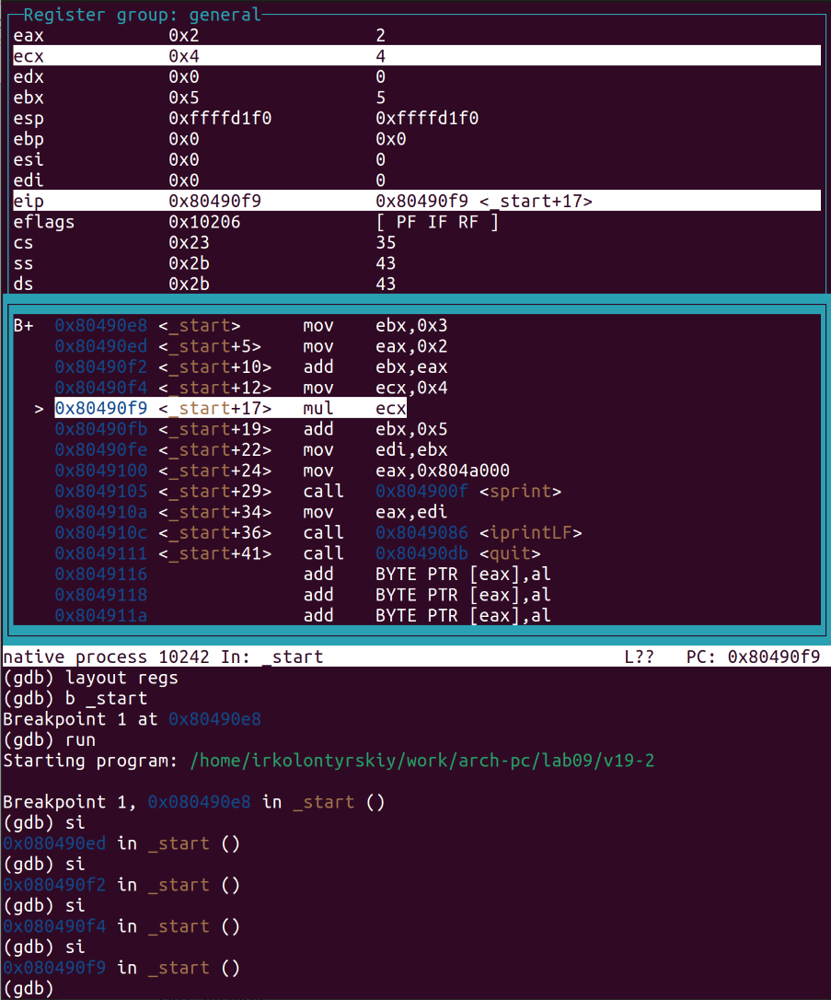

Видно, что при умножении результат сохраняется в eax, хотя кодом подразумавается сохранение в ebx. Запустим код и убедимся, что он работает неверно (Рис. 3.33)

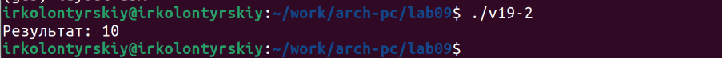

Изменим его так, чтобы умножалось нужное нам значение, а не то, что хранится в регистре eax изначально (Рис. 2.24)

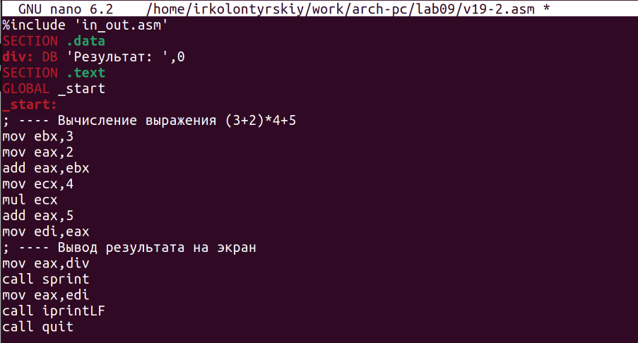

Проверим правильность его работы, скомпилировав его и запустив (Рис. 2.35)

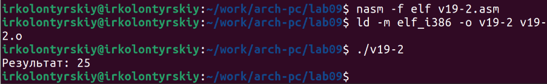

Теперь код работает правильно

# Выводы

Были получены навыки работы с adb, а также получены навыки работы с подпрограммами
