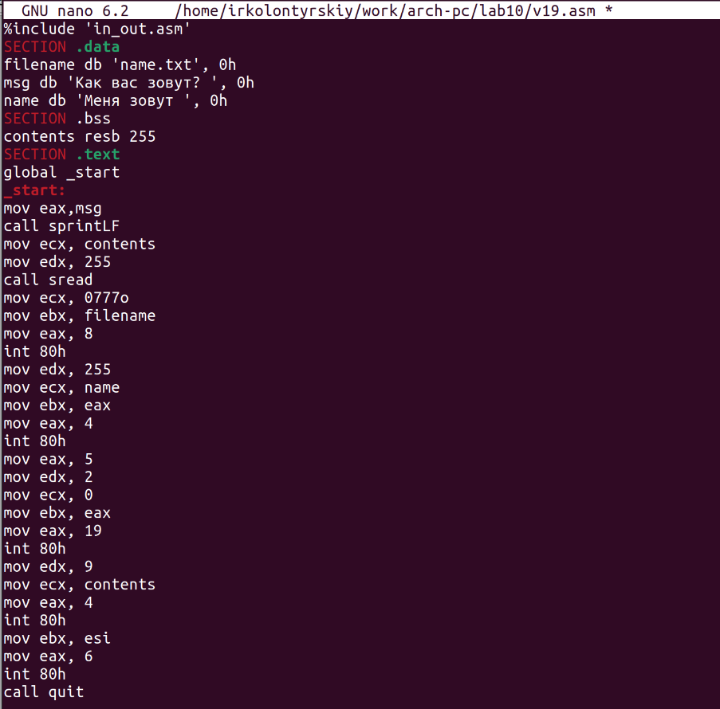

---
## Front matter
title: "Лабораторная работа №10"
subtitle: "Работа с файлами средствами Nasm"
author: "Колонтырский Илья Русланович"

## Generic otions
lang: ru-RU
toc-title: "Содержание"

## Bibliography
bibliography: bib/cite.bib
csl: pandoc/csl/gost-r-7-0-5-2008-numeric.csl

## Pdf output format
toc: true # Table of contents
toc-depth: 2
lof: true # List of figures
lot: true # List of tables
fontsize: 12pt
linestretch: 1.5
papersize: a4
documentclass: scrreprt
## I18n polyglossia
polyglossia-lang:
  name: russian
  options:
	- spelling=modern
	- babelshorthands=true
polyglossia-otherlangs:
  name: english
## I18n babel
babel-lang: russian
babel-otherlangs: english
## Fonts
mainfont: PT Serif
romanfont: PT Serif
sansfont: PT Sans
monofont: PT Mono
mainfontoptions: Ligatures=TeX
romanfontoptions: Ligatures=TeX
sansfontoptions: Ligatures=TeX,Scale=MatchLowercase
monofontoptions: Scale=MatchLowercase,Scale=0.9
## Biblatex
biblatex: true
biblio-style: "gost-numeric"
biblatexoptions:
  - parentracker=true
  - backend=biber
  - hyperref=auto
  - language=auto
  - autolang=other*
  - citestyle=gost-numeric
## Pandoc-crossref LaTeX customization
figureTitle: "Рис."
tableTitle: "Таблица"
listingTitle: "Листинг"
lofTitle: "Список иллюстраций"
lotTitle: "Список таблиц"
lolTitle: "Листинги"
## Misc options
indent: true
header-includes:
  - \usepackage{indentfirst}
  - \usepackage{float} # keep figures where there are in the text
  - \floatplacement{figure}{H} # keep figures where there are in the text
---

# Цель работы

Приобретение навыков написания программ для работы с файлами

# Выполнение лабораторной работы

Создадим папку и файлы lab10-1.asm, readme-1.txt и readme-2.txt (Рис. 2.1)

Вставим в файл lab10-1.asm предложенный код (Рис. 2.2)

Скомпилируем программу и проанализируем результат (Рис. 2.3)

Ничего не произошло. Это потому, что программа пытается записать текст в файл, которого не существует.
Теперь запретим выполнение программы и попробуем её запустить (Рис. 2.4)

Нам вывело, что отказано в доступе, и программа запустилась. Попробуем предоставить файлу с исходным кодом права на выполнение и запустим его (Рис. 2.5)

Вывело много ошибок потому, что файл предназначен для компиляции, а не для запуска. Выдадим файлам readme-1.txt и readme-2.txt права, как в 19 варианте. Мы задаём права в восьмиричном виде (Рис. 2.6)

Права установились верно 

 Самостоятельная работа

Создадим файл самостоятельной работы (Рис. 2.7)

Теперь напишем следующий код (Рис. 2.8)

Теперь соберём программу и запустим её. Проверим успешность записи результата программы в файл с помощью ls и cat (Рис. 2.9)

Программа выполнилась корректно

# Выводы

Были приобретены навыки написания программ, работающих с файлами, а также было получено понимание работы разрешений в ОС Linux
